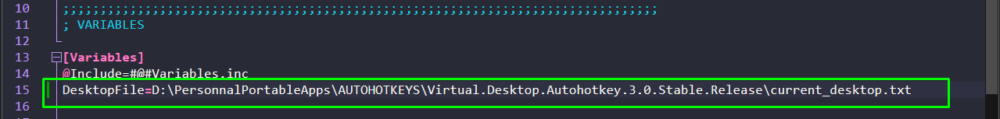
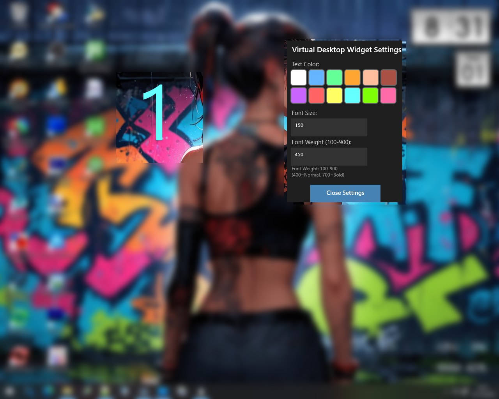
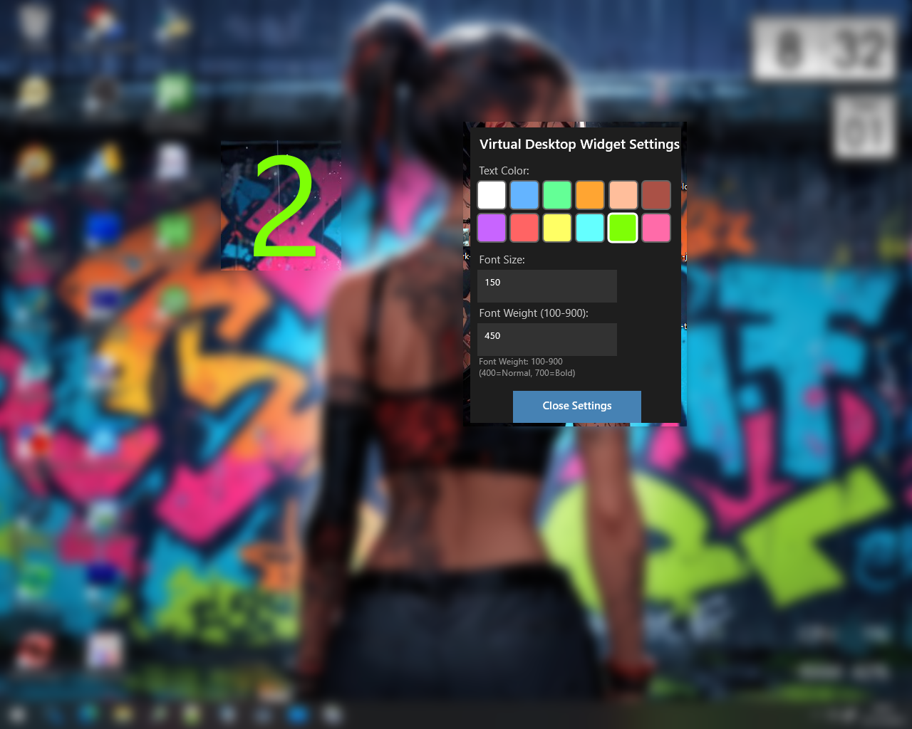
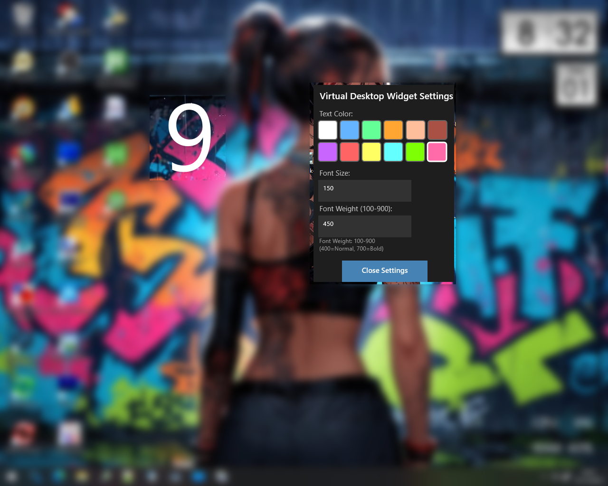
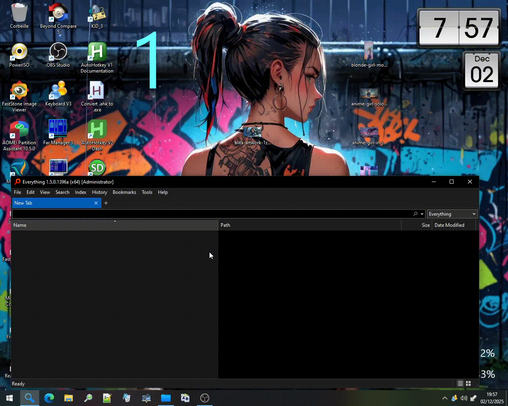

___

## 🎁 Virtual Desktop Switcher for Windows 11 & 10 🖥️

A powerful AutoHotkey script that adds keyboard shortcuts for managing Windows virtual desktops with visual feedback through Rainmeter integration.
___

## About VD.ahk Library 📚 (AHKV2 LIBRARY 👉 WIN 11)

VD.ahk is an AutoHotkey v2 library that provides direct access to Windows' Virtual Desktop APIs. It's specifically optimized for Windows 11 because:

- ✨ Native Windows 11 Support - Built using the modern Virtual Desktop COM interfaces that Windows 11 relies on
- ⚡ Better Performance - AHK v2 offers faster execution and lower overhead than v1
- 🔧 Modern Architecture - Cleaner, more maintainable codebase aligned with Windows 11's desktop management system
- 🛡️ Enhanced Stability - More reliable desktop switching and window management on Windows 11

___

Why Windows 11? (Though Windows 10 Still Works) 🤔
- While this tool functions on Windows 10, it's designed with Windows 11 in mind because:
- Windows 11 has a redesigned Virtual Desktop system with different API implementations
- The v2 library handles Windows 11's desktop management more gracefully
- Future Windows updates will focus on Win11+ compatibility
- AHK v2 itself has better compatibility with modern Windows features

___

The older V3 version (from the GitHub link) uses AutoHotkey v1, which lacks the modern API access methods that make virtual desktop management smoother and more reliable on Windows 11 🙂

___

🌐 Virtual Desktop Widget with Rainmeter & AutoHotkey

- 🌿 Version 3.0 – Stable Release 🌿
## 👀 AHKV1 LIBRARY 👉 WIN 10
- 🌹 Created by AndrianAngel 🌹

🧠 Overview

This project enhances Windows Virtual Desktops with a live visual widget powered by Rainmeter and controlled via AutoHotkey. It displays the current virtual desktop number in real time and updates instantly as you switch desktops using custom hotkeys.

You also get a built-in GUI to customize the widget's appearance—choose your favorite color, font size, and weight with just a few clicks.

---

🖼️ Screenshots

😎 Widget 😎

1- Current_desktop.txt path

2 - Demo

3 - Demo

4 - Demo

---

🚀 Features

- Live Desktop Number Display  
  Rainmeter skin reads from current_desktop.txt and updates as you switch desktops.

- Custom Hotkey System (AutoHotkey)  
  - LCtrl + Numpad [1–9]: Switch to desktop  
  - LCtrl + Win + Numpad [1–9]: Move window and follow  
  - RCtrl + Numpad [1–9]: Throw window without following  
  - Alt + Numpad+ / Numpad-: Create/remove desktops  
  - Alt + Numpad0: Pin/unpin window  
  - LCtrl + F1/F2/F6: Query desktop info

- Rainmeter Widget Customization GUI  
  Right-click the widget → Virtual.Desktop.Widget.3.0 > Settings > Settings.ini  
  - 15 preset colors  
  - Adjustable font size and weight  
  - Live preview with instant refresh

---

🛠️ Installation & Setup

1. AutoHotkey Script
- Run Virtual.Desktop.Autohotkey.3.0.Stable.Release.ahk
- It creates current_desktop.txt in the same folder

2. Rainmeter Skin
- Unzip Virtual.Desktop.Widget.Rainmeter.3.0.Stable.Release.zip into:  
  Documents\Rainmeter\Skins\Virtual.Desktop.Widget.3.0
- Open Virtual.Desktop.Number.ini and set the correct path:
  `ini
  DesktopFile=D:\Your\Path\To\current_desktop.txt
  `
- Load the skin in Rainmeter and refresh everything

3. Customize
- Right-click the widget → Settings
- Use the GUI to tweak color, font size, and weight

---

📁 File Structure

| File | Purpose |
|------|---------|
| Virtual.Desktop.Autohotkey.3.0.Stable.Release.ahk | Main AHK script with hotkeys and Rainmeter sync |
| VD.ahk | Virtual Desktop library |
| current_desktop.txt | Auto-generated file storing current desktop number |
| Virtual.Desktop.Widget.Rainmeter.3.0.Stable.Release.zip | Rainmeter skin package |
| Settings.ini | GUI configuration for widget customization |
| Variables.inc | Stores user preferences (color, font size, weight) |
| Images/A1–A4.png | Screenshots for visual reference |

---

💡 Why This Project?

Windows Virtual Desktops are powerful—but invisible. This widget makes them visible, interactive, and customizable, bridging the gap between automation and aesthetics.

---

😎😎 Overview Demo 😎😎

---

---
## 🌿 Make sure to choose the right version according to your OS 🌿

- 📜 While both work on Win10/11, the v2 library provides a significantly better experience on Windows 11 due to its modern API integration 🙂 : 🌱 Virtual.Desktop.Switcher.Windows11.10.AHKV2.zip 🌱

- 📣 Stay on Virtual.Desktop.3.0 if you're using Windows 10 (AHKV1 Library) : 👉 Virtual.Desktop.Widget.Rainmeter.3.0.Stable.Release.zip 👈

___
